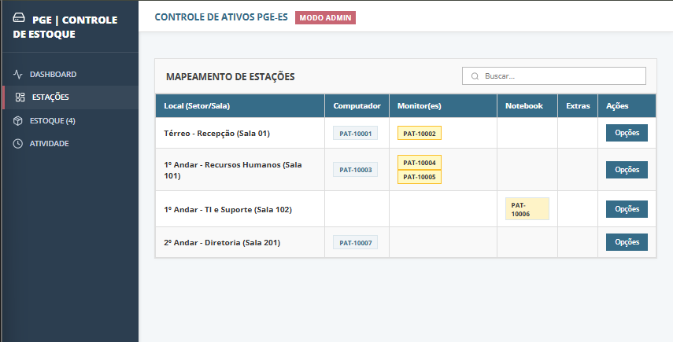

# 💻 Sistema de Controle de Ativos de TI (IT Asset Management)

## 🏢 Sobre o Projeto
Sistema Full-Stack desenvolvido para modernizar e centralizar a gestão de patrimônio de TI dentro de uma organização corporativa. O objetivo da aplicação é substituir o controle manual feito em planilhas por um painel visual dinâmico, respondendo rapidamente: **O que temos? Onde está? Qual o histórico?**

## ✨ Funcionalidades Principais
* **Acesso Baseado em Regras (Role-Based):** Visão pública de leitura para visitantes e visão restrita protegida por Autenticação JWT simulada (Login) para administradores.
* **Gestão de Estoque:** Cadastro, edição e deleção de equipamentos (Computadores, Monitores, Notebooks) com número de patrimônio e controle de status (Novo, Usado, Defeito).
* **Mapeamento Físico de Estações:** Vinculação e desvinculação em tempo real de equipamentos do estoque para estações de trabalho (por andar, setor e sala).
* **Dashboard Interativo:** Visão geral em tempo real com métricas de ativos totais, itens no estoque da TI e itens pendentes de tombamento.
* **Log de Auditoria:** Registro automatizado de todas as movimentações de patrimônio (data, hora e ação realizada) para rastreabilidade.

## 🛠️ Tecnologias Utilizadas

O projeto adota o padrão de separação de responsabilidades (SoC), dividindo a aplicação em dois ecossistemas:

### Frontend (Interface Gráfica)
* **React 19**
* **Vite** (Build tool hiper-rápido)
* **React Router DOM** (Roteamento entre páginas e proteção de rotas privadas)
* **Axios** (Comunicação HTTP via Interceptors para injeção de tokens)
* **Lucide React** (Ícones SVG otimizados)
* **CSS Puro** (Com variáveis globais padronizadas com a identidade visual corporativa)

### Backend (API REST & Banco de Dados)
* **Python 3**
* **Flask** (Microframework para rotas RESTful)
* **SQLite3** (Banco de dados relacional embutido)
* **Flask-CORS** (Para permitir comunicação entre portas diferentes no localhost)

---

## 🚀 Como executar este projeto localmente

Para rodar a aplicação na sua máquina, você precisará do **Node.js** e do **Python** instalados. Recomenda-se o uso do **VS Code**.

### 1. Clone o repositório
\`\`\`bash
git clone https://github.com/freitasigor/controle-estoque-pge-es.git
cd controle-estoque-pge-es
\`\`\`

### 2. Configure e inicie o Backend (API)
Abra um terminal no VS Code e acesse a pasta do backend:
\`\`\`bash
cd backend
\`\`\`
Instale as bibliotecas necessárias (caso não tenha):
\`\`\`bash
pip install flask flask-cors
\`\`\`
Gere o banco de dados com os dados fictícios iniciais:
\`\`\`bash
python gerar_ficticios.py
\`\`\`
Inicie o servidor (ele rodará na porta `5000`):
\`\`\`bash
python INICIAR.py
\`\`\`

### 3. Configure e inicie o Frontend
Abra um **segundo terminal** (mantenha o primeiro rodando o servidor Python) e acesse a pasta do frontend:
\`\`\`bash
cd frontend
\`\`\`
Instale as dependências do Node:
\`\`\`bash
npm install
\`\`\`
Inicie a aplicação React:
\`\`\`bash
npm run dev
\`\`\`
*O terminal exibirá um link local (geralmente `http://localhost:5173/`). Clique com \`Ctrl\` pressionado para abrir no navegador.*

---

## 🔐 Acesso Administrador (Modo de Edição)
Por padrão, a tela inicial abre em modo leitura. Para testar o painel de criação, edição e movimentação de equipamentos, clique em **"Acesso Restrito"** no menu inferior esquerdo e utilize as credenciais de teste:

* **Usuário:** `admin`
* **Senha:** `pge@123`

---
*Desenvolvido como demonstração de habilidades Full-Stack para portfólio.*
